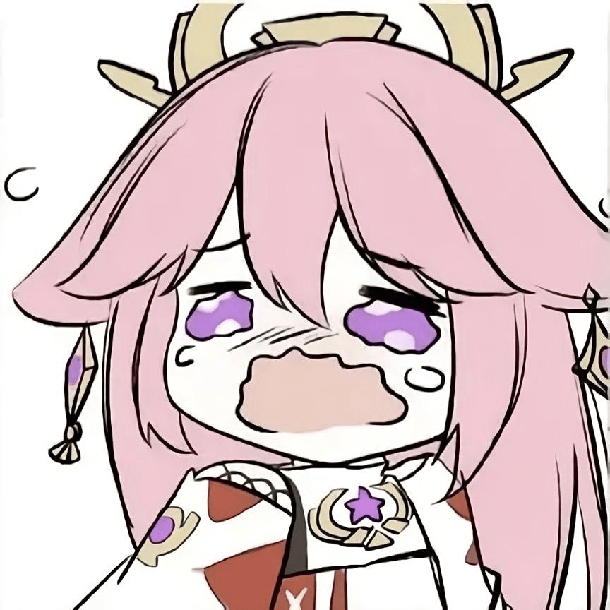

# learning-golang
Hi. This is the “learning-golang” project I created to share with you the things I've learned on my own.

**gitbook: https://hackpatato.gitbook.io/hackpatato-docs**

  

NOTE!: *I now publish my written documentation exclusively on GitBook.*
